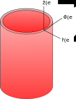

# FEBio_ConstrainedMixture
Under development....

# actualizacion#1
# actualizacion#2
# actualizacion#3
# actualizacion#4 (14/11)

=======

# PASOS PARA ACTUALIZAR REPOSITORIO #
# 1) git pull
# 2) git add <archivo trabajado>
# 3) git commit -m "mensaje"
# 4) git pull
# 5) git mergetool (si hay confictos)
# 6) git push origin main
# 7) git push upstream main
